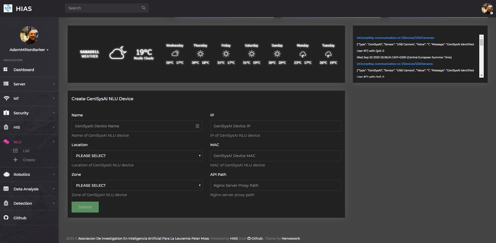

# Asociacion De Investigacion En Inteligencia Artificial Para La Leucemia Peter Moss
## GeniSysAI
### Raspberry Pi 3 Natural Language Understanding Engine

[](https://github.com/LeukemiaAiResearch/GeniSysAI)

&nbsp;

# Table Of Contents

- [Introduction](#introduction)
- [Prerequisites](#prerequisites)
  - [HIAS Server](#hias-server)
- [Hardware Requirements](#hardware-requirements)
- [System Requirements](#system-requirements)
- [Software Requirements](#software-requirements)
- [Installation](#server-setup)
  - [UFW Firewall](#ufw-firewall)
  - [Clone the repository](#clone-the-repository)
      - [Developer Forks](#developer-forks)
  - [Install Required Software](#install-requried-software)
  - [Configuration](#configuration)
    - [iotJumpWay](#iotjumpway)
    - [HIAS Proxy](#hias-proxy)
- [Training Data](#training-data)
- [Extensions](#extensions)
- [Training](#training)
- [Communicate Locally](#communicate-locally)
  - [Say Hello](#say-hello)
  - [Extension Example](#extension-example)
- [HTTP Request Inference](#http-request-inference)
- [Useful Links](#useful-links)
- [Stay Tuned](#stay-tuned)
- [More Knowledge](#more-knowledge)
- [Contributing](#contributing)
    - [Contributors](#contributors)
- [Versioning](#versioning)
- [License](#license)
- [Bugs/Issues](#bugs-issues)

&nbsp;

# Introduction
The **HIAS GeniSysAI Raspberry Pi 3 Natural Language Understanding Engine** is an open-source Tensorflow Natural Language Understanding Engine. The system hosts a REST API endpoint that exposes the model for remote classification. A small dataset is provided for you to build on.

&nbsp;

# Prerequisites
Before you can install this project there are some prerequisites.

## HIAS Server
If you are going to be using the full system you will need to install the [HIAS](https://github.com/LeukemiaAiResearch/HIAS) server. Follow the [HIAS Installation Guide](https://github.com/LeukemiaAiResearch/HIAS/blob/master/Documentation/Installation/Installation.md) to complete your HIAS server setup.

&nbsp;

# Hardware Requirements

- 1 x Desktop device or laptop for development and training, preferably with an NVIDIA GPU
- 1 x Raspberry Pi
- 1 x Audio speaker (Jack connection)

&nbsp;

# System Requirements
- [Raspberry Pi OS](https://www.raspberrypi.org/downloads/raspberry-pi-os/)
- [Python 3.7](https://www.python.org/ "Python 3.7")
- PIP3

&nbsp;

# Software Requirements
- [Tensorflow 1.14.0](https://github.com/lhelontra/tensorflow-on-arm/releases/tag/v1.14.0-buster "Tensorflow 1.14.0")
- [TFLearn](http://tflearn.org/ "TFLearn")
- [MITIE](https://github.com/mit-nlp/MITIE "MITIE")
- [NTLK (Natural Language Toolkit)](https://www.nltk.org/ "NTLK (Natural Language Toolkit)")
- [IPInfo.io Key](https://ipinfo.io/ "IPInfo.io Key")

&nbsp;

# Installation
The following guides will give you the basics of setting up a GeniSys NLU Engine.

## Clone the repository
Clone the [HIAS GeniSysAI](https://github.com/LeukemiaAiResearch/GeniSysAI "HIAS GeniSysAI") repository from the [Asociacion De Investigacion En Inteligencia Artificial Para La Leucemia Peter Moss](https://github.com/LeukemiaAiResearch "Asociacion De Investigacion En Inteligencia Artificial Para La Leucemia Peter Moss") Github Organization.

To clone the repository and install the UP2 OpenVINO USB Camera Security System, make sure you have Git installed. Now navigate to the home directory on your device using terminal/commandline, and then use the following command.

```
  git clone https://github.com/LeukemiaAiResearch/GeniSysAI.git
```

Once you have used the command above you will see a directory called **GeniSysAI** in your home directory.

```
  ls
```

Using the ls command in your home directory should show you the following.

```
  GeniSysAI
```

Navigate to **GeniSysAI/NLU/RPI/RPI3/TF1.14.0** directory, this is your project root directory for this tutorial.

### Developer Forks
Developers from the Github community that would like to contribute to the development of this project should first create a fork, and clone that repository. For detailed information please view the [CONTRIBUTING](../../../../CONTRIBUTING.md "CONTRIBUTING") guide. You should pull the latest code from the development branch.

```
  git clone -b "0.5.0" https://github.com/LeukemiaAiResearch/GeniSysAI.git
```

The **-b "0.5.0"** parameter ensures you get the code from the latest master branch. Before using the below command please check our latest master branch in the button at the top of the project README.

## Install Required Software

Now you need to install the required software, we have provided a requirements file that will contain all required modules for the project. You can use it to install the modules using the following command:

```
  sed -i 's/\r//' Setup.sh
  sh Setup.sh
```

The command execute the setup shell file which will istall the required software for the project including **NTLK**, **TFLearn**, **MITIE**. If for any reason the pip3 installs fail, you will have to install them manually:

```
  pip3 install ..... --user
```

## Configuration
The configuration for the NLU can be found in [Required/config.json](Required/config.json).

First of all update the core settings. You need add the IP address of your Raspberry Pi and your IPInfo.io key:
```
  "System": {
      "IP": "",
      "IPInfo": "",
      "Logs": "Logs/",
      "Port": 8080
  }
```

### iotJumpWay

Now you need to create your HIAS iotJumpWay NLU device to retrieve your MQTT credentials. Head to your HIAS UI and navigate to **NLU->Create**. Fill out the details on that page making sure you use **API** for the **API Path** and click **Submit** unless this is not your first installation. Your device will be created and you will be redirected to the device page where you can access your credentials. Use the credentials to complete your iotJumpWay configuration.
```
  "iotJumpWay": {
      "lid": 0,
      "zid": 0,
      "did": 0,
      "dn": "",
      "host": "",
      "port": 8883,
      "un": "",
      "pw": "",
      "Channels": {
          "Commands": "Commands"
      }
  }
```
### HIAS Proxy
Now you need to the add your HIAS proxy that will allow encrypted connection to your NLU. On your HIAS machine use the following command to open up your HIAS server configuration:

```
sudo nano /etc/nginx/sites-available/default
```
Now add the following block underneath your existing GeniSysAI proxy rules. You should replace **###.###.#.##** with the IP address of your Raspberry Pi. If you changed the default port number you should also replace **8080** with that port.

```
  location ~ ^/GeniSysAI/NLU/API/(.*)$ {
    auth_basic "Restricted";
    auth_basic_user_file /etc/nginx/security/htpasswd;
    proxy_pass http://192.168.1.55:8080/$1;
  }
```

&nbsp;

# Training Data

Now it is time to think about training data. In the [Model/Data/training.json](Model/Data/training.json "Model/Data/training.json") file we have provided some starter data, it is not a lot but enough to have a good test and show the example further on in the tutorial.

&nbsp;

# Extensions

Extensions are external Python classes that you can use to extend the functionality used to generate a response. Extensions should be stored in the [Extensions](Extensions "Extensions") directory.

In this version we have provided a simple time extension [Extensions/gTime.py](Extensions/gTime.py "Extensions/gTime.py") and the related training data. An example of triggering this extension is provided below.

&nbsp;

# Training

Now everything is set up, it is time to train. The main functionality for the training process can be found in [Train.py](Train.py "Train.py"), [Classes/Data.py](Classes/Data.py "Classes/Data.py"), [Classes/Model.py](Classes/Model.py "Classes/Model.py") and [Classes/Mitie.py](Classes/Mitie.py "Classes/Mitie.py"), the configuration for training can be found and modified in [Required/config.json](Required/config.json "Required/config.json"). If you have modified your training data, you may need to update your configuration from time to time.

To begin training, make sure you are all set up, navigate to the root of the project and execute the following command:

```
  python3 Run.py Train
```

&nbsp;

# Communicate Locally

Now you have trained your AI, it is time to test her out! As your AI is now trained, all you need to do (assuming you are in the project root), is execute the following code:

```
  python3 NLU.py Input
```

Or if you want the response to come through your RPI speaker:

```
  python3 NLU.py Input True
```
The model NLU may take a few moments to boot up as we are loading it on a Raspberry Pi. Once the model is loaded you will see the following:
```
>
```

## Say Hello
Let's start by saying a simple hello. At the prompt type "hello" and hit enter. The response will be displayed in the console and if you have chosen to use the speaker you will hear the response. You should see the following if you are not using audio:
```
2020-09-02 03:23:50,925 - NLU - INFO - Hola
```
And the following if you are using audio:
```
2020-09-02 03:23:50,925 - NLU - INFO - Hola
High Performance MPEG 1.0/2.0/2.5 Audio Player for Layers 1, 2 and 3
        version 1.25.10; written and copyright by Michael Hipp and others
        free software (LGPL) without any warranty but with best wishes


Terminal control enabled, press 'h' for listing of keys and functions.

Playing MPEG stream 1 of 1: temp.mp3 ...

MPEG 2.0 L III cbr32 24000 mono

[0:00] Decoding of temp.mp3 finished.
```
## Extension Example
Now let's try the **gTime** example. At the prompt, ask what time it is, say something like:
```
I was wondering if you could possibly tell me what time it is
```
If you look at the training data for that intent, you will be able to see the instruction to use the **gTime.getTime** extension when that particular intent is matched. First the NLU will respond with the standard response, then the extension will be executed. You will notice some extension responses with the **%%TIME** value. These responses are passed to the extension which gets the current time and replace the placeholder with the current time forming the final response.
```
{
    "intent": "TimeQuery",
    "text": [
        "What is the time?",
        "What's the time?",
        "Do you know what time it is?",
        "Do you know the time?",
        "Can you tell me the time?",
        "Tell me what time it is?",
        "Time"
    ],
    "responses": [
        "One moment",
        "One sec",
        "One second"
    ],
    "extension": {
        "function": "Extensions.gTime.getTime",
        "entities": false,
        "responses": [
            "The time is %%TIME%%",
            "Right now it is %%TIME%%",
            "It is around %%TIME%%"
        ]
    },
```
You will notice that the intent used above **I was wondering if you could possibly tell me what time it is** does not actually exist in the training data for that intent, but the

&nbsp;

# HTTP Request Inference

You can run the Run program in server mode to fire up an API endpoint that allows you to do inference via HTTP calls. To start your NLU engine in server mode, you can enter the following commands into terminal:

```
  python3 NLU.py Server
```

Or if you want the response to come through your RPI speaker:

```
  python3 NLU.py Server True
```

You will now be able to access your NLU by posting to http://YourIP:YourPort/Infer, to do this, we provided an an API client programmed in Python which takes your input from console and sends it to the server for processing: [Client.py](Client.py "Client.py").

Navigate to the project root and execute the following command to send a query to your NLU engine, you can use any question or statement, but bear in mind it must be within the boundaries of variations of the training date.

```
 python3 Client.py "Hey, what's up? How about telling me the time"
```

You should see the following output in the console:

```
2020-09-02 04:00:42,116 - Client - INFO - Sending string for classification...
2020-09-02 04:00:50,252 - Client - INFO - Response: {
    "Response": "OK",
    "ResponseData": [
        {
            "Confidence": "0.5613834",
            "Context": [
                {
                    "Current": "",
                    "In": "",
                    "Out": ""
                }
            ],
            "Entities": [],
            "Extension": "Extensions.gTime.getTime",
            "Intent": "TimeQuery",
            "Received": "Hey, what's up? How about telling me the time",
            "Response": "The time is Wed Sep  2 04:00:42 2020"
        }
    ]
}
```

Again, this phrase is nothing like any phrase in the training data, but the AI responded correctly.

Just for fun let's try a joke:

```
python3 Client.py Audio "Hey I am feeling down could you tell me a joke to cheer me up?"
```

Response:

```
pi@GeniSys:~/GeniSysAI/NLU/RPI3B $ python3 Client.py Audio "Hey I am feeling down could you tell me a joke to cheer me up?"
2020-09-02 04:04:06,594 - Client - INFO - Helpers class initialization complete.
2020-09-02 04:04:06,594 - Client - INFO - Client ready
2020-09-02 04:04:06,595 - Client - INFO - Sending string for classification...
2020-09-02 04:04:14,741 - Client - INFO - Response: {
    "Response": "OK",
    "ResponseData": [
        {
            "Confidence": "0.82161534",
            "Context": [
                {
                    "Current": "",
                    "In": "",
                    "Out": ""
                }
            ],
            "Entities": [],
            "Extension": null,
            "Intent": "Jokes",
            "Received": "Hey I am feeling down could you tell me a joke to cheer me up?",
            "Response": "The other day someone left a piece of plastacine in my bedroom. I didn't know what to make of it."
        }
    ]
}
```

&nbsp;

# More Knowledge

The dataset will continue to grow so if you use this project, make sure you return regularly to get the latest dataset and any code updates for your project. You can also build your own dataset and train your AI to repond how you want it to.

&nbsp;

# Contributing
Asociacion De Investigacion En Inteligencia Artificial Para La Leucemia Peter Moss encourages and welcomes code contributions, bug fixes and enhancements from the Github community.

Please read the [CONTRIBUTING](../../../../CONTRIBUTING.md "CONTRIBUTING") document for a full guide to forking our repositories and submitting your pull requests. You will also find information about our code of conduct on this page.

## Contributors

- [Adam Milton-Barker](https://www.leukemiaresearchassociation.ai/team/adam-milton-barker "Adam Milton-Barker") - [Asociacion De Investigacion En Inteligencia Artificial Para La Leucemia Peter Moss](https://www.leukemiaresearchassociation.ai "Asociacion De Investigacion En Inteligencia Artificial Para La Leucemia Peter Moss") President & Lead Developer, Sabadell, Spain

&nbsp;

# Versioning

We use SemVer for versioning. For the versions available, see [Releases](../../../../releases "Releases").

&nbsp;

# License

This project is licensed under the **MIT License** - see the [LICENSE](../../../../LICENSE "LICENSE") file for details.

&nbsp;

# Bugs/Issues

We use the [repo issues](../../../../issues "repo issues") to track bugs and general requests related to using this project.