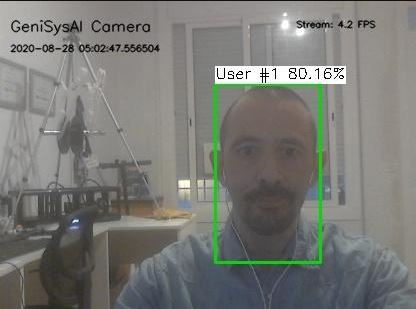
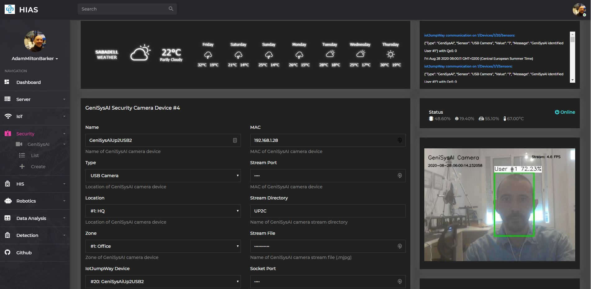

# Asociacion De Investigacion En Inteligencia Artificial Para La Leucemia Peter Moss
## GeniSysAI
### UP2 OpenVINO USB Camera Security System

[](https://github.com/LeukemiaAiResearch/GeniSysAI)

&nbsp;

# Table Of Contents

- [Introduction](#introduction)
- [Siamese Neural Networks](#siamese-neural-networks)
- [Triplet Loss](#triplet-loss)
- [Intel® Movidius™ Neural Compute Stick 1](#intel-movidius-neural-compute-stick-1)
- [Intel® Movidius™ Neural Compute Stick 2](#intel-movidius-neural-compute-stick-2)
- [Prerequisites](#prerequisites)
  - [HIAS Server](#hias-server)
- [System Requirements](#system-requirements)
- [Hardware Requirements](#hardware-requirements)
- [Setup](#setup)
  - [UFW Firewall](#ufw-firewall)
  - [Intel® Distribution of OpenVINO™ Toolkit](#intel-distribution-of-openvino-toolkit)
    - [Intel® Movidius™ Neural Compute Stick and Intel® Neural Compute Stick 2](#intel-movidius-neural-compute-stick-and-inte-neural-compute-stick-2)
  - [Clone the repository](#clone-the-repository)
      - [Developer Forks](#developer-forks)
  - [Install Dependencies](#install-dependencies)
  - [Known & Test Datasets](#known--test-datasets)
  - [Configuration](#configuration)
    - [iotJumpWay](#iotJumpWay)
  - [Server Test](#server-test)
  - [HIAS Proxy](#hias-proxy)
  - [Service Setup](#service-setup)
- [HIAS UI](#hias-ui)
- [Contributing](#contributing)
    - [Contributors](#contributors)
- [Versioning](#versioning)
- [License](#license)
- [Bugs/Issues](#bugs-issues)

&nbsp;

# Introduction
The UP2 OpenVINO USB Camera Security System connects to a USB camera and uses **facial detection**/**facial reidentification** and **facial landmark** classifier to provide Facial Recognition with OpenVINO on the CPU and VPU (Intel® Movidius™ Neural Compute Stick and Intel® Neural Compute Stick 2).

&nbsp;

# Intel® Movidius™ Neural Compute Stick 1

The Intel® Movidius™ Neural Compute Stick is a piece of hardware, specifically a USB device, used for enhancing the inference process of computer vision models on low-powered/edge devices. The Intel® Movidius™ product is a USB appliance that can be plugged into devices such as Raspberry Pi and UP Squared, and basically takes the processing power off the device and onto the Intel Movidius brand chip, making the classification process a lot faster.

&nbsp;

# Intel® Movidius™ Neural Compute Stick 2

The Intel® Movidius™ Neural Compute Stick 2 is the latest version of the Neural Compute Stick.

&nbsp;

# Prerequisites
Before you can install this project there are some prerequisites.

## HIAS Server
If you are going to be using the full system you will need to install the [HIAS](https://github.com/LeukemiaAiResearch/HIAS) server. Follow the [HIAS Installation Guide](https://github.com/LeukemiaAiResearch/HIAS/blob/master/Documentation/Installation/Installation.md) to complete your HIAS server setup.

&nbsp;

# System Requirements
- Tested on Ubuntu 18.04 & 16.04
- [Python 3.6](https://www.python.org/ "Python 3.6")
- Requires PIP3
- [Tensorflow 1.4.0](https://www.tensorflow.org/install "Tensorflow 1.4.0")

# Hardware Requirements
- 1 x [Intel® Movidius™ Neural Compute Stick](https://www.movidius.com/ "Intel® Movidius™ Neural Compute Stick") (Optional)
- 1 x [Intel® Movidius™ Neural Compute Stick 2](https://www.movidius.com/ "Intel® Movidius™ Neural Compute Stick 2") (Optional)
- 1 x UP Squared

&nbsp;

# Setup
Now we will setup the UP2 OpenVINO USB Camera Security System. The following tutorial will take you through the setup steps.

## UFW Firewall
UFW firewall is used to protect the ports of your device. Use the following command to check the status of your firewall:

```
  sudo ufw status
```
You should see the output:
```
  Status: inactive
```

The ports are specified in **Required/config.json**. The default setting is set to **8080** for the streaming port.

**FOR YOUR SECURITY YOU SHOULD CHANGE THIS!**.

```
  "Server": {
      "IP": "",
      "Port": 8080
  }
```

To allow access to the ports use the following command for each of your ports:

```
  sudo ufw allow 22
  sudo ufw allow 8080
  audo ufw enable
  sudo ufw status
```

You should see the following output:

```
  Status: active

  To                         Action      From
  --                         ------      ----
  22                         ALLOW       Anywhere
  8080                       ALLOW       Anywhere
  22 (v6)                    ALLOW       Anywhere (v6)
  8080 (v6)                  ALLOW       Anywhere (v6)
```

## Intel® Distribution of OpenVINO™ Toolkit

For this project we will install OpenVINO 2020.3 as it is the final version that works with NCS1 which will be used in another project in this repository.

Follow the steps on [this link](https://software.seek.intel.com/openvino-toolkit?os=linux) to download OpenVINO, making sure you choose 2020.3.

Make sure the compressed folder is in you user home directory and use the following steps:

```
  tar -xvzf l_openvino_toolkit_p_2020.3.194.tgz
  cd l_openvino_toolkit_p_2020.3.194
  sudo ./install.sh
```

Follow the installation guide, once you have accepted the End User License and concented, or not consented to the collection of your data, the script will check the prerequisites.

When you are told about missing dependencies. choose **1** to **Skip prerequisites** and then **1** again, and once more to **Skip prerequisites**.

When instructed to, press **Enter** to quit.

Now we need to update our **.bashrc** file so that OpenVINO loads every time you open a terminal.

In your user home directory, use the following command:
```
  nano ~/.bashrc
```
This will open up the file in Nano. Scroll to the bottom and add:

```
  # OpenVINO
  source /opt/intel/openvino/bin/setupvars.sh
```
Save and close the file then use the following command to source the .bashrc file:
```
  source ~/.bashrc
```
You will see the following:
```
  [setupvars.sh] OpenVINO environment initialized
```
And now we will configure the model optimizer:
```
  cd /opt/intel/openvino/deployment_tools/model_optimizer/install_prerequisites
  sudo ./install_prerequisites.sh
```
### Intel® Movidius™ Neural Compute Stick and Intel® Neural Compute Stick 2
Now we will set up ready for Neural Compute Stick and Neural Compute Stick 2.
```
  sudo usermod -a -G users "$(whoami)"
```
Now close your existing terminal and open a new open. Once in your new terminal use the following commands:
```
  sudo cp /opt/intel/openvino/inference_engine/external/97-myriad-usbboot.rules /etc/udev/rules.d/
  sudo udevadm control --reload-rules
  sudo udevadm trigger
  sudo ldconfig
```

## Clone the repository
Clone the [HIAS GeniSysAI](https://github.com/LeukemiaAiResearch/GeniSysAI "HIAS GeniSysAI") repository from the [Asociacion De Investigacion En Inteligencia Artificial Para La Leucemia Peter Moss](https://github.com/LeukemiaAiResearch "Asociacion De Investigacion En Inteligencia Artificial Para La Leucemia Peter Moss") Github Organization.

To clone the repository and install the UP2 OpenVINO USB Camera Security System, make sure you have Git installed. Now navigate to the home directory on your device using terminal/commandline, and then use the following command.

```
  git clone https://github.com/LeukemiaAiResearch/GeniSysAI.git
```

Once you have used the command above you will see a directory called **GeniSysAI** in your home directory.

```
  ls
```

Using the ls command in your home directory should show you the following.

```
  GeniSysAI
```

Navigate to **GeniSysAI/Vision/UP2/OpenVINO/USBCam** directory, this is your project root directory for this tutorial.

### Developer Forks
Developers from the Github community that would like to contribute to the development of this project should first create a fork, and clone that repository. For detailed information please view the [CONTRIBUTING](../../../../../CONTRIBUTING.md "CONTRIBUTING") guide. You should pull the latest code from the development branch.

```
  git clone -b "0.2.0" https://github.com/LeukemiaAiResearch/GeniSysAI.git
```

The **-b "0.2.0"** parameter ensures you get the code from the latest master branch. Before using the below command please check our latest master branch in the button at the top of the project README.

## Install Dependencies
Now you will install the required dependencies. [Setup.sh](Setup.sh "Setup.sh")is an executable shell script that will do the following:

- Install the required Python packages
- Downloads the pretrained Facenet model (**davidsandberg/facenet**)
- Downloads the pretrained **Inception V3** model graph

To execute the script, make enter the following commands. This will take a long time!

```
  sed -i 's/\r//' Setup.sh
  sh Setup.sh
```

## Known & Test Datasets
Before you can use your facial identification server, you need to add 1 image of all people that you want your server to classify as known to the **Model/Data/Known** directory and as many different faces as you like to the **Model/Data/Test** directory.

## Configuration
You need to updated the following settings in [Required/config.json](Required/config.json "Required/config.json") to ensure that your server is accessible.

```
    "Camera": {
        "Id": 0,
        "IP": "",
        "Port": 8080
    }
```
You should also update the socket configuration settings.

```
  "Socket": {
      "host": "localhost",
      "port": 8181
  }
```

Remember if you change the port settings, you need to allow these through the UFW firewall.

### iotJumpWay


You need to setup your iotJumpWay GeniSysAI security device that will be used to communicate with the HIAS iotJumpWay broker. In the HIAS UI, navigate to **Security->GeniSysAI->Create**.

- For **Name** add a custom name for your device
- For **Type** select **USB Camera**
- For **Location** and **Zone** select the iotJumpWay location and zone, if you have not set these up yet you can do this in the **IoT** section.
- For **IP** add the IP address of your UP2 device.
- For **Mac** add the MAC address of your UP2 device.
- For **Stream Port**, add whatever port you used above in your configuration settings.
- For **Stream Directory**, this can be anything you like, your HIAS proxy will use this name to direct traffic to the correct device.
- For **Stream File**, this can be anything you like but it must end with **.mjpg**.
- For **Socket Port** add what ever port you used in the configuration.

Once you have created your device you will be taken to the new device page. Add your server name and the information provided on that page to your  configuration.

```
  "iotJumpWay": {
    "host": "",
    "port": 8883,
    "ip": "localhost",
    "lid": 0,
    "zid": 0,
    "did": 0,
    "dn": "",
    "un": "",
    "pw": ""
  }
```

## HIAS Proxy
Now you need to the entry to your HIAS proxy that will allow encrypted connection protected by a password. Use the following command to open up your HIAS server configuration:

```
sudo nano /etc/nginx/sites-available/default
```
Now add the following block underneath your existing GeniSysAI server camera proxy rules. You should replace **StreamDirectory** with the value you entered into the HIAS UI for **Stream Directory** and replace **###.###.#.##** with the IP address of your UP2. If you changed the default port number you should also replace **8080** with that port.

```
location ~* ^/Security/GeniSysAI/StreamDirectory/(.*)$ {
  auth_basic "Restricted";
  auth_basic_user_file /etc/nginx/security/htpasswd;
  proxy_pass http://###.###.#.##:8080/$1;
}
```

## Server Test
To make sure that your server is responding correctly, you need to open two terminals.

In your first terminal, use the following command:

```
 sudo python3 Camera.py
```

You should see the following output:

```
2020-08-28 04:58:01,149 - Camera - INFO - Helpers class initialization complete.
2020-08-28 04:58:01,151 - iotJumpWay - INFO - Helpers class initialization complete.
2020-08-28 04:58:01,152 - iotJumpWay - INFO - Initiating Local iotJumpWay Device.
2020-08-28 04:58:01,152 - iotJumpWay - INFO - JumpWayMQTT Device Initiated.
2020-08-28 04:58:01,152 - iotJumpWay - INFO - Initiating Local iotJumpWay Device Connection.
2020-08-28 04:58:01,178 - iotJumpWay - INFO - Local iotJumpWay Device Connection Initiated.
2020-08-28 04:58:01,179 - iotJumpWay - INFO - -- Subscribed to Device Commands Channel
2020-08-28 04:58:01,181 - Sockets - INFO - Helpers class initialization complete.
2020-08-28 04:58:01,182 - Sockets - INFO - Socket Helper Class initialization complete.
2020-08-28 04:58:01,182 - Camera - INFO - Camera Class initialization complete.
2020-08-28 04:58:01,193 - GeniSysAI - INFO - Helpers class initialization complete.
2020-08-28 04:58:01,201 - GeniSysAI - INFO - GeniSysAI class initialized.
2020-08-28 04:58:01,192 - Sockets - INFO - Subscribed to socket: tcp://localhost:8181
2020-08-28 04:58:01,203 - OpenCV - INFO - Helpers class initialization complete.
2020-08-28 04:58:01,208 - Camera - INFO - Camera server started on ###.###.#.##:8080
2020-08-28 04:58:01,215 - OpenCV - INFO - OpenCV class initialized.
2020-08-28 04:58:01,218 - GeniSysAI - INFO - Connected To Camera
2020-08-28 04:58:01,220 - GeniSysAI - INFO - Loading the model from '/home/#######/GeniSysAI/Vision/UP2/OpenVINO/USBCam/Model/face-detection-retail-0004.xml'
2020-08-28 04:58:01,229 - OpenCV - INFO - Connecting to USB camera.
2020-08-28 04:58:01,287 - iotJumpWay - INFO - Local iotJumpWay Device Connection Successful.
2020-08-28 04:58:01,287 - GeniSysAI - INFO - Model loaded
2020-08-28 04:58:01,288 - iotJumpWay - INFO - rc: 0
2020-08-28 04:58:01,298 - GeniSysAI - INFO - Loading the model from '/home//#######/GeniSysAI/Vision/UP2/OpenVINO/USBCam/Model/landmarks-regression-retail-0009.xml'
2020-08-28 04:58:01,299 - iotJumpWay - INFO - Published to Device Status 1/Devices/1/20/Status
2020-08-28 04:58:01,315 - GeniSysAI - INFO - Model loaded
2020-08-28 04:58:01,316 - GeniSysAI - INFO - Loading the model from '/home//#######/GeniSysAI/Vision/UP2/OpenVINO/USBCam/Model/face-reidentification-retail-0095.xml'
2020-08-28 04:58:01,317 - iotJumpWay - INFO - JumpWayMQTT Subscription: 1
2020-08-28 04:58:01,394 - GeniSysAI - INFO - Model loaded
2020-08-28 04:58:01,557 - Camera - INFO - GeniSysAI Life (TEMPERATURE): 59.0°
2020-08-28 04:58:01,558 - Camera - INFO - GeniSysAI Life (CPU): 40.2%
2020-08-28 04:58:01,558 - Camera - INFO - GeniSysAI Life (Memory): 15.4%
2020-08-28 04:58:01,558 - Camera - INFO - GeniSysAI Life (HDD): 55.1%
2020-08-28 04:58:01,558 - Camera - INFO - GeniSysAI Life (LAT): 41.3888
2020-08-28 04:58:01,867 - Camera - INFO - GeniSysAI Life (LNG): 2.1590
2020-08-28 04:58:02,190 - OpenCV - INFO - Connected to Foscam.
2020-08-28 04:58:02,532 - iotJumpWay - INFO - -- Published to Device channel
2020-08-28 04:58:02,534 - iotJumpWay - INFO - -- Published to Device channel
2020-08-28 04:58:03,757 - GeniSysAI - INFO - Models loaded
2020-08-28 04:58:04,487 - GeniSysAI - INFO - Database is built, registered 1 identities
2020-08-28 04:58:04,488 - Sockets - INFO - Started & connected to socket server: tcp://localhost:8181
```

Now visit URL replacing the values as expected: **http://YourUp2Ip:YourPort/YourStreamFile**.

If everything has been done correctly you will now see the live stream from your USB camera in your browser.



### Neural Compute Stick and Neural Compute Stick 2
The default configuration runs the system on the CPU. In the configuration settings you can change **Classifer->runas** to **Myriad** to run on either NCS1 or NCS2.
```
  "Classifier": {
      "Allowed": [
          ".jpg",
          ".JPG",
          ".png",
          ".PNG"
      ],
      "detection": "Model/face-detection-retail-0004.xml",
      "reidentification": "Model/face-reidentification-retail-0095.xml",
      "landmarks": "Model/landmarks-regression-retail-0009.xml",
      "runas": "MYRIAD",
      "Known": "Model/Data/Known/",
      "Test": "Model/Data/Test/",
      "Threshold": 1.20
  }
```

Running on the CPU we can see around ~4 - 4.2 FPS, running on NCS1 we can see ~4.7 - 4.9, running on NCS2 we can see ~4.8 - 4.9.

## Service Setup
To ensure that the system will start each time your UP2 boots up, we will create two services.

First add your user to the video group, this will allow you to access the camera without sudo. Replace **YourUser** with the username you use to login to the UP2 with.

```
sudo gpasswd -M YourUser video
```

Update **Camera.sh** replacing **YourUsername** with the username you use to log in to your UP2.

```
#!/bin/bash
source /opt/intel/openvino/bin/setupvars.sh
/usr/bin/python3 /home/YourUser/GeniSysAI/Vision/UP2/OpenVINO/USBCam/Camera.py
```

Use the following command to create and open a new service file for reading and processing the streams from the USB camera.

```
  sudo nano /lib/systemd/system/Camera.service
```

Next add the following code to the file, replacing **YourUser** with the username you use to login to your UP2 with.

```
[Unit]
Description=GeniSysAI USB Camera Security System
After=multi-user.target

[Service]
User=YourUser
Type=simple
ExecStart=/home/YourUser/GeniSysAI/Vision/UP2/OpenVINO/USBCam/Camera.sh

[Install]
WantedBy=multi-user.target
```

Save and close the file. Now use the following command to restart the services daemon:

```
  sudo systemctl daemon-reload
```

Now enable, start and check your USB reading service:

```
sudo systemctl enable Camera.service
sudo systemctl start Camera.service
sudo systemctl status Camera.service
```

You should see the following output.

```
● api.service - GeniSysAI USB Camera Security System
   Loaded: loaded (/lib/systemd/system/Camera.service; enabled; vendor preset: enabled)
   Active: active (running) since Mon 2020-08-24 19:45:31 CEST; 4s ago
 Main PID: 3481 (python3)
    Tasks: 4
   Memory: 46.3M
      CPU: 2.878s
   CGroup: /system.slice/Camera.service
           └─3481 /usr/bin/python3 /home/YourUser/GeniSysAI/Vision/UP2/OpenVINO/USBCam/Camera.py
```

Your system will now start every time you boot up your UP2. You can use the following commands to manage your service in the future.

```
sudo systemctl restart Camera.service
sudo systemctl start Camera.service
sudo systemctl stop Camera.service
sudo systemctl status Camera.service
```

# HIAS UI


If you visit the device page in the HIAS UI by navigating to **Security->GeniSysAI->List**, you will be able to locate your device. On your device page you will be able to see your stream. This stream is encrypted and is password protected. If you have not authenticated yourself for the HIAS streams a pop up will ask you to provide your HIAS UI user credentials.


Your UP2 will publish device vitals to the iotJumpWay broker regularly, these can be viewed in the data section by visiting **IoT->Data**. You will also be able to see classifications from the facial recognition classifier as shown below.


&nbsp;

# Contributing
Asociacion De Investigacion En Inteligencia Artificial Para La Leucemia Peter Moss encourages and welcomes code contributions, bug fixes and enhancements from the Github community.

Please read the [CONTRIBUTING](../../../../../CONTRIBUTING.md "CONTRIBUTING") document for a full guide to forking our repositories and submitting your pull requests. You will also find information about our code of conduct on this page.

## Contributors

- [Adam Milton-Barker](https://www.leukemiaresearchassociation.ai/team/adam-milton-barker "Adam Milton-Barker") - [Asociacion De Investigation En Inteligencia Artificial Para La Leucemia Peter Moss](https://www.leukemiaresearchassociation.ai "Asociacion De Investigation En Inteligencia Artificial Para La Leucemia Peter Moss") President & Lead Developer, Sabadell, Spain

&nbsp;

# Versioning

We use SemVer for versioning. For the versions available, see [Releases](../../../../../releases "Releases").

&nbsp;

# License

This project is licensed under the **MIT License** - see the [LICENSE](../../../../../LICENSE "LICENSE") file for details.

&nbsp;

# Bugs/Issues

We use the [repo issues](../../../../../issues "repo issues") to track bugs and general requests related to using this project.